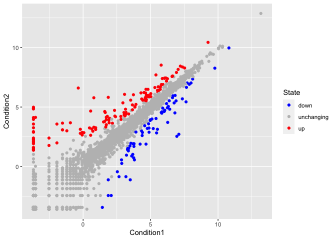
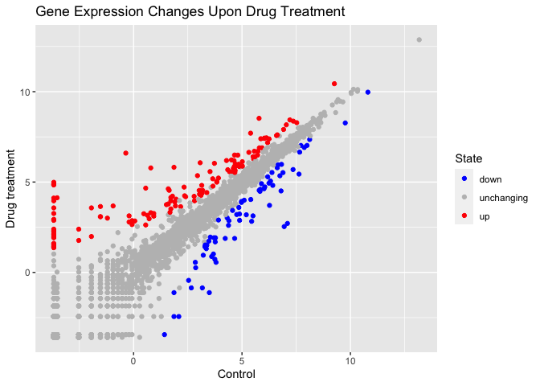
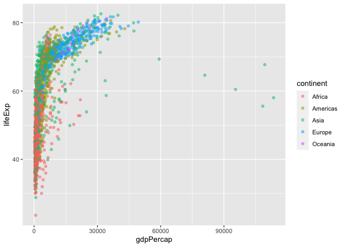
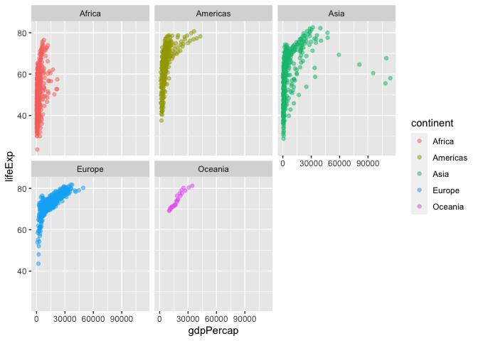
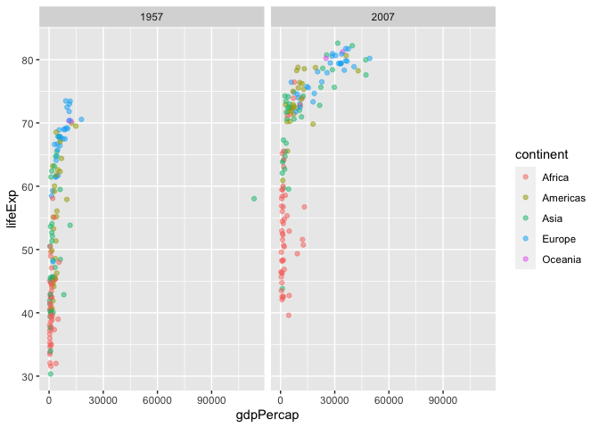
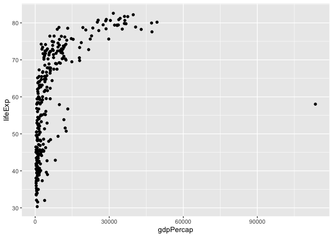

BGGN213 Class 5 Data Visualization
================
Wenxi Tang

# Plotting in R

R has many plotting and visualization systems including “base” R.

``` r
head(cars)
```

      speed dist
    1     4    2
    2     4   10
    3     7    4
    4     7   22
    5     8   16
    6     9   10

``` r
plot(cars)
```


Base R plots can be quite simple for basic plots when compared to
systems like ggplot.

To use an add on package, like ggplot, first need to get it installed in
my computer.

We use the function `install.packages()` with the name of the package
you want to install.

``` r
library(ggplot2)
ggplot(cars)
```


ggplot is much more verbose than base R plot and every single ggplot
needs at least 3 things:

- **Data** (this is the data.frame with the data we want to plot)
- **Aesthetics** or aes() for short (this is how data map to the plot)
- **Geoms** (like geom_point(), geom_line(), specify the plot type)

``` r
ggplot(cars) +
  aes(x=speed, y=dist) +
  geom_point() +
  theme_bw() + 
  geom_smooth(method ="lm", se = FALSE)
```

    `geom_smooth()` using formula = 'y ~ x'


## A plot of some gene expression data

The code to read the data:

``` r
url <- "https://bioboot.github.io/bimm143_S20/class-material/up_down_expression.txt"
genes <- read.delim(url)
head(genes)
```

            Gene Condition1 Condition2      State
    1      A4GNT -3.6808610 -3.4401355 unchanging
    2       AAAS  4.5479580  4.3864126 unchanging
    3      AASDH  3.7190695  3.4787276 unchanging
    4       AATF  5.0784720  5.0151916 unchanging
    5       AATK  0.4711421  0.5598642 unchanging
    6 AB015752.4 -3.6808610 -3.5921390 unchanging

> Q. Find out how many genes there are in this dataset.

``` r
nrow(genes)
```

    [1] 5196

There are 5196 genes in this dataset.

> Q. How many genes are up-regulated?

``` r
table(genes$State)
```


          down unchanging         up 
            72       4997        127 

Another way to do it:

``` r
sum(genes$State == "up")
```

    [1] 127

Let’s plot it.

``` r
ggplot(genes) +
  aes(x = Condition1, y = Condition2, color = State) +
  geom_point()
```


``` r
#scale_colour_manual(values = c("blue", "grey", "red"))
```

I can save any ggplot object for use later so I don’t need to type it
all out agin. Here I save my starting plo to `p`, if I need to add any
layer I can just type `p + more layers`

``` r
p <- ggplot(genes) +
      aes(x = Condition1, y = Condition2, color = State) +
      geom_point()
p_colored <- p + scale_colour_manual(values = c("blue", "grey", "red"))
p_colored
```



Change the axis titles for the graph

``` r
p_titled <- p_colored + labs(title = "Gene Expression Changes Upon Drug Treatment", 
         x = "Control",
         y = "Drug treatment")
p_titled
```



## Gapminder dataset plots - A more complex ggplot example

One of the big wins with ggplot is to facet your data into sub-plots.

``` r
# File location online
url <- "https://raw.githubusercontent.com/jennybc/gapminder/master/inst/extdata/gapminder.tsv"

gapminder <- read.delim(url)
head(gapminder)
```

          country continent year lifeExp      pop gdpPercap
    1 Afghanistan      Asia 1952  28.801  8425333  779.4453
    2 Afghanistan      Asia 1957  30.332  9240934  820.8530
    3 Afghanistan      Asia 1962  31.997 10267083  853.1007
    4 Afghanistan      Asia 1967  34.020 11537966  836.1971
    5 Afghanistan      Asia 1972  36.088 13079460  739.9811
    6 Afghanistan      Asia 1977  38.438 14880372  786.1134

> Q. How many countries are in this dataset?

``` r
length(unique(gapminder$country))
```

    [1] 142

There are 142 in this dataset.

> Q. How many years are spanned in this dataset?

``` r
range(gapminder$year)
```

    [1] 1952 2007

> Q. Which country has the smallest population?

``` r
min(gapminder$pop)
```

    [1] 60011

``` r
#First where is this min value in the pop vector
index <- which.min(gapminder$pop)
#Now use the index to access the $country in the dataset
gapminder$country[index]
```

    [1] "Sao Tome and Principe"

``` r
gapminder[index, ]
```

                       country continent year lifeExp   pop gdpPercap
    1297 Sao Tome and Principe    Africa 1952  46.471 60011  879.5836

Plot the life expectancy versus GDP

``` r
ggplot(gapminder) +
  aes(x = gdpPercap, y = lifeExp, color = continent) +
  geom_point(alpha = 0.5)
```



``` r
ggplot(gapminder) +
  aes(x = gdpPercap, y = lifeExp, color = continent) +
  geom_point(alpha = 0.5) +
  facet_wrap(~continent)
```



``` r
library(dplyr)
```


    Attaching package: 'dplyr'

    The following objects are masked from 'package:stats':

        filter, lag

    The following objects are masked from 'package:base':

        intersect, setdiff, setequal, union

``` r
gapminder_1957_2007 <- gapminder %>% filter (year == 1957 | year == 2007)
head(gapminder_1957_2007)
```

          country continent year lifeExp      pop gdpPercap
    1 Afghanistan      Asia 1957  30.332  9240934  820.8530
    2 Afghanistan      Asia 2007  43.828 31889923  974.5803
    3     Albania    Europe 1957  59.280  1476505 1942.2842
    4     Albania    Europe 2007  76.423  3600523 5937.0295
    5     Algeria    Africa 1957  45.685 10270856 3013.9760
    6     Algeria    Africa 2007  72.301 33333216 6223.3675

``` r
ggplot(gapminder_1957_2007) +
  aes(x = gdpPercap, y = lifeExp, color = continent) +
  geom_point(alpha = 0.5) +
  facet_wrap(~year)
```



``` r
ggplot(gapminder_1957_2007, aes(gdpPercap, lifeExp)) + geom_point()
```


