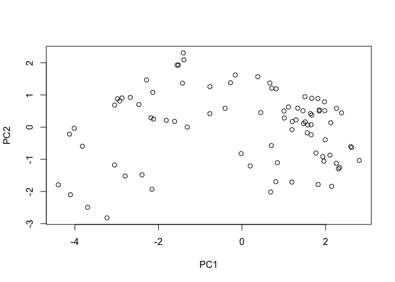

Class 10: Halloween Mini-Project
================
Wenxi Tang

# 1. Imparting candy data

``` r
#read the csv file
candy_file <- "candy-data.csv"

candy = read.csv(candy_file, row.names=1)
head(candy)
```

                 chocolate fruity caramel peanutyalmondy nougat crispedricewafer
    100 Grand            1      0       1              0      0                1
    3 Musketeers         1      0       0              0      1                0
    One dime             0      0       0              0      0                0
    One quarter          0      0       0              0      0                0
    Air Heads            0      1       0              0      0                0
    Almond Joy           1      0       0              1      0                0
                 hard bar pluribus sugarpercent pricepercent winpercent
    100 Grand       0   1        0        0.732        0.860   66.97173
    3 Musketeers    0   1        0        0.604        0.511   67.60294
    One dime        0   0        0        0.011        0.116   32.26109
    One quarter     0   0        0        0.011        0.511   46.11650
    Air Heads       0   0        0        0.906        0.511   52.34146
    Almond Joy      0   1        0        0.465        0.767   50.34755

> Q1. How many different candy types are in this dataset?

``` r
#types of candy is the number of rows
nrow(candy)
```

    [1] 85

> Q2. How many fruity candy types are in the dataset?

``` r
#use the table() to get how many 1 are under column "fruity"
table(candy$fruity)
```


     0  1 
    47 38 

``` r
#sum the column of "fruity" gives the fruity candy types
sum(candy$fruity)
```

    [1] 38

38 out of 85 types of candy are in the dataset.

One of the most interesting variables in the dataset is winpercent. For
a given candy this value is the percentage of people who prefer this
candy over another randomly chosen candy from the dataset (what 538 term
a matchup). Higher values indicate a more popular candy.

``` r
candy["Twix", ]$winpercent
```

    [1] 81.64291

# 2. What is your favorate candy?

> Q3. What is your favorite candy in the dataset and what is it’s
> winpercent value?

My favorite candy is Hershey’s Kisses. Its winpercent value is 55.37545.

``` r
candy["Hershey's Kisses", ]$winpercent
```

    [1] 55.37545

> Q4. What is the winpercent value for “Kit Kat”?

Kitkat winpercent: 76.7686.

``` r
candy["Kit Kat", ]$winpercent
```

    [1] 76.7686

> Q5. What is the winpercent value for “Tootsie Roll Snack Bars”?

Tootsie Roll Snack Bars: 49.6535.

``` r
candy["Tootsie Roll Snack Bars", ]$winpercent
```

    [1] 49.6535

``` r
library(skimr)
skim(candy)
```

|                                                  |       |
|:-------------------------------------------------|:------|
| Name                                             | candy |
| Number of rows                                   | 85    |
| Number of columns                                | 12    |
| \_\_\_\_\_\_\_\_\_\_\_\_\_\_\_\_\_\_\_\_\_\_\_   |       |
| Column type frequency:                           |       |
| numeric                                          | 12    |
| \_\_\_\_\_\_\_\_\_\_\_\_\_\_\_\_\_\_\_\_\_\_\_\_ |       |
| Group variables                                  | None  |

Data summary

**Variable type: numeric**

| skim_variable    | n_missing | complete_rate |  mean |    sd |    p0 |   p25 |   p50 |   p75 |  p100 | hist  |
|:-----------------|----------:|--------------:|------:|------:|------:|------:|------:|------:|------:|:------|
| chocolate        |         0 |             1 |  0.44 |  0.50 |  0.00 |  0.00 |  0.00 |  1.00 |  1.00 | ▇▁▁▁▆ |
| fruity           |         0 |             1 |  0.45 |  0.50 |  0.00 |  0.00 |  0.00 |  1.00 |  1.00 | ▇▁▁▁▆ |
| caramel          |         0 |             1 |  0.16 |  0.37 |  0.00 |  0.00 |  0.00 |  0.00 |  1.00 | ▇▁▁▁▂ |
| peanutyalmondy   |         0 |             1 |  0.16 |  0.37 |  0.00 |  0.00 |  0.00 |  0.00 |  1.00 | ▇▁▁▁▂ |
| nougat           |         0 |             1 |  0.08 |  0.28 |  0.00 |  0.00 |  0.00 |  0.00 |  1.00 | ▇▁▁▁▁ |
| crispedricewafer |         0 |             1 |  0.08 |  0.28 |  0.00 |  0.00 |  0.00 |  0.00 |  1.00 | ▇▁▁▁▁ |
| hard             |         0 |             1 |  0.18 |  0.38 |  0.00 |  0.00 |  0.00 |  0.00 |  1.00 | ▇▁▁▁▂ |
| bar              |         0 |             1 |  0.25 |  0.43 |  0.00 |  0.00 |  0.00 |  0.00 |  1.00 | ▇▁▁▁▂ |
| pluribus         |         0 |             1 |  0.52 |  0.50 |  0.00 |  0.00 |  1.00 |  1.00 |  1.00 | ▇▁▁▁▇ |
| sugarpercent     |         0 |             1 |  0.48 |  0.28 |  0.01 |  0.22 |  0.47 |  0.73 |  0.99 | ▇▇▇▇▆ |
| pricepercent     |         0 |             1 |  0.47 |  0.29 |  0.01 |  0.26 |  0.47 |  0.65 |  0.98 | ▇▇▇▇▆ |
| winpercent       |         0 |             1 | 50.32 | 14.71 | 22.45 | 39.14 | 47.83 | 59.86 | 84.18 | ▃▇▆▅▂ |

> Q6. Is there any variable/column that looks to be on a different scale
> to the majority of the other columns in the dataset?

Yes, the “winpercent” variable looks to be on a different scale.

> Q7. What do you think a zero and one represent for the
> candy\$chocolate column?

1 represents this candy type has chocolate (whatever ingredient the
column name is) in it while 0 represents no chocolate in this candy
type. Therefore most of variables(columns) have only 0 or 1.

> Q8. Plot a histogram of winpercent values

``` r
hist(candy$winpercent)
```


> Q9. Is the distribution of winpercent values symmetrical?

It’s not symmetrical, it’s a little bit skew to the right.

> Q10. Is the center of the distribution above or below 50%?

It’s below 50%.

> Q11. On average is chocolate candy higher or lower ranked than fruit
> candy?

``` r
as.logical(candy$chocolate)
```

     [1]  TRUE  TRUE FALSE FALSE FALSE  TRUE  TRUE FALSE FALSE FALSE  TRUE FALSE
    [13] FALSE FALSE FALSE FALSE FALSE FALSE FALSE FALSE FALSE FALSE  TRUE  TRUE
    [25]  TRUE  TRUE FALSE  TRUE  TRUE FALSE FALSE FALSE  TRUE  TRUE FALSE  TRUE
    [37]  TRUE  TRUE  TRUE  TRUE  TRUE FALSE  TRUE  TRUE FALSE FALSE FALSE  TRUE
    [49] FALSE FALSE FALSE  TRUE  TRUE  TRUE  TRUE FALSE  TRUE FALSE FALSE  TRUE
    [61] FALSE FALSE  TRUE FALSE  TRUE  TRUE FALSE FALSE FALSE FALSE FALSE FALSE
    [73] FALSE FALSE  TRUE  TRUE  TRUE  TRUE FALSE  TRUE FALSE FALSE FALSE FALSE
    [85]  TRUE

``` r
sum(as.logical(candy$chocolate))
```

    [1] 37

``` r
#mean winpercent of chocolate candy
mean(candy$winpercent[as.logical(candy$chocolate)])
```

    [1] 60.92153

``` r
#mean winpercent of fruit candy
mean(candy$winpercent[as.logical(candy$fruity)])
```

    [1] 44.11974

``` r
#t-test
t.test(candy$winpercent[as.logical(candy$chocolate)], candy$winpercent[as.logical(candy$fruity)])
```


        Welch Two Sample t-test

    data:  candy$winpercent[as.logical(candy$chocolate)] and candy$winpercent[as.logical(candy$fruity)]
    t = 6.2582, df = 68.882, p-value = 2.871e-08
    alternative hypothesis: true difference in means is not equal to 0
    95 percent confidence interval:
     11.44563 22.15795
    sample estimates:
    mean of x mean of y 
     60.92153  44.11974 

Because the p-value is below 0.05, we consider the difference
statistically significant.

# 3. Overall Candy Rankings

Let’s use the base R order() function together with head() to sort the
whole dataset by winpercent. Or if you have been getting into the
tidyverse and the dplyr package you can use the arrange() function
together with head() to do the same thing and answer the following
questions:

> Q13. What are the five least liked candy types in this set?

``` r
#order by increasing winpercent value
least <- head(candy[order(candy$winpercent),], n=5)
least
```

                       chocolate fruity caramel peanutyalmondy nougat
    Nik L Nip                  0      1       0              0      0
    Boston Baked Beans         0      0       0              1      0
    Chiclets                   0      1       0              0      0
    Super Bubble               0      1       0              0      0
    Jawbusters                 0      1       0              0      0
                       crispedricewafer hard bar pluribus sugarpercent pricepercent
    Nik L Nip                         0    0   0        1        0.197        0.976
    Boston Baked Beans                0    0   0        1        0.313        0.511
    Chiclets                          0    0   0        1        0.046        0.325
    Super Bubble                      0    0   0        0        0.162        0.116
    Jawbusters                        0    1   0        1        0.093        0.511
                       winpercent
    Nik L Nip            22.44534
    Boston Baked Beans   23.41782
    Chiclets             24.52499
    Super Bubble         27.30386
    Jawbusters           28.12744

> Q14. What are the top 5 all time favorite candy types out of this set?

``` r
#order by decreasing winpercent
favorite <- head(candy[order(candy$winpercent, decreasing = T),], n=5)
favorite
```

                              chocolate fruity caramel peanutyalmondy nougat
    Reese's Peanut Butter cup         1      0       0              1      0
    Reese's Miniatures                1      0       0              1      0
    Twix                              1      0       1              0      0
    Kit Kat                           1      0       0              0      0
    Snickers                          1      0       1              1      1
                              crispedricewafer hard bar pluribus sugarpercent
    Reese's Peanut Butter cup                0    0   0        0        0.720
    Reese's Miniatures                       0    0   0        0        0.034
    Twix                                     1    0   1        0        0.546
    Kit Kat                                  1    0   1        0        0.313
    Snickers                                 0    0   1        0        0.546
                              pricepercent winpercent
    Reese's Peanut Butter cup        0.651   84.18029
    Reese's Miniatures               0.279   81.86626
    Twix                             0.906   81.64291
    Kit Kat                          0.511   76.76860
    Snickers                         0.651   76.67378

> Q15. Make a first barplot of candy ranking based on winpercent values.

``` r
library(ggplot2)

ggplot(candy) + 
  aes(winpercent, rownames(candy)) +
  geom_col()
```


> Q16. This is quite ugly, use the reorder() function to get the bars
> sorted by winpercent?

``` r
ggplot(candy) + 
  aes(winpercent, reorder(rownames(candy),winpercent)) +
  geom_col()
```


Let’s setup a color vector (that signifies candy type) that we can then
use for some future plots. We start by making a vector of all black
values (one for each candy). Then we overwrite chocolate (for chocolate
candy), brown (for candy bars) and red (for fruity candy) values.

``` r
my_cols=rep("black", nrow(candy))
my_cols[as.logical(candy$chocolate)] = "chocolate"
my_cols[as.logical(candy$bar)] = "brown"
my_cols[as.logical(candy$fruity)] = "pink"
```

``` r
#make a colored ggplot
ggplot(candy) + 
  aes(winpercent, reorder(rownames(candy),winpercent)) +
  geom_col(fill=my_cols) 
```


> Q17. What is the worst ranked chocolate candy?

Sixlets.

> Q18. What is the best ranked fruity candy?

Starburst.

# 4. Taking a look at pricepercent

What about value for money? What is the the best candy for the least
money? One way to get at this would be to make a plot of winpercent vs
the pricepercent variable. The pricepercent variable records the
percentile rank of the candy’s price against all the other candies in
the dataset. Lower vales are less expensive and high values more
expensive.

``` r
library(ggrepel)

# How about a plot of price vs win
ggplot(candy) +
  aes(winpercent, pricepercent, label=rownames(candy)) +
  geom_point(col=my_cols) + 
  geom_text_repel(col=my_cols, size=3.3, max.overlaps = 5)
```

    Warning: ggrepel: 50 unlabeled data points (too many overlaps). Consider
    increasing max.overlaps


> Q19. Which candy type is the highest ranked in terms of winpercent for
> the least money - i.e. offers the most bang for your buck?

Reese’s Miniatures. It appears in the graph at the most right bottom
corner, which means that it has very high winpercent and low
pricepercent.

> Q20. What are the top 5 most expensive candy types in the dataset and
> of these which is the least popular?

``` r
#order dataset by decreasing pricepercent
expensive5 <- candy[order(candy$pricepercent, decreasing = T),]
head(expensive5, n=5)
```

                             chocolate fruity caramel peanutyalmondy nougat
    Nik L Nip                        0      1       0              0      0
    Nestle Smarties                  1      0       0              0      0
    Ring pop                         0      1       0              0      0
    Hershey's Krackel                1      0       0              0      0
    Hershey's Milk Chocolate         1      0       0              0      0
                             crispedricewafer hard bar pluribus sugarpercent
    Nik L Nip                               0    0   0        1        0.197
    Nestle Smarties                         0    0   0        1        0.267
    Ring pop                                0    1   0        0        0.732
    Hershey's Krackel                       1    0   1        0        0.430
    Hershey's Milk Chocolate                0    0   1        0        0.430
                             pricepercent winpercent
    Nik L Nip                       0.976   22.44534
    Nestle Smarties                 0.976   37.88719
    Ring pop                        0.965   35.29076
    Hershey's Krackel               0.918   62.28448
    Hershey's Milk Chocolate        0.918   56.49050

The most expensive candies are shown above, the least popular one is Nik
L Nip.

> Q21. Make a barplot again with geom_col() this time using pricepercent
> and then improve this step by step, first ordering the x-axis by value
> and finally making a so called “dot chat” or “lollipop” chart by
> swapping geom_col() for geom_point() + geom_segment().

``` r
ggplot(candy) + 
  aes(pricepercent, reorder(rownames(candy),pricepercent)) +
  geom_col()
```


``` r
# Make a lollipop chart of pricepercent
ggplot(candy) +
  aes(pricepercent, reorder(rownames(candy), pricepercent)) +
  geom_segment(aes(yend = reorder(rownames(candy), pricepercent), 
                   xend = 0), col="gray40") +
    geom_point()
```


# 5 Exploring the correlation structure

Now that we’ve explored the dataset a little, we’ll see how the
variables interact with one another. We’ll use correlation and view the
results with the corrplot package to plot a correlation matrix.

``` r
library(corrplot)
```

    corrplot 0.92 loaded

``` r
cij <- cor(candy)
corrplot(cij)
```


> Q22. Examining this plot what two variables are anti-correlated
> (i.e. have minus values)?

There are many pairs of variables that are anti-correlated: Chocolate &
fruity Bar & Pluribus Bar & Fruity Pricepercent & fruity Winpercent &
fruity …

> Q23. Similarly, what two variables are most positively correlated?

Winpercent and chocolate are most positively correlated.

# 6. Principal Component Analysis

Let’s apply PCA using the prcom() function to our candy dataset
remembering to set the scale=TRUE argument.

``` r
#PCA analysis with scaling
pca <- prcomp(candy, scale = T)
summary(pca)
```

    Importance of components:
                              PC1    PC2    PC3     PC4    PC5     PC6     PC7
    Standard deviation     2.0788 1.1378 1.1092 1.07533 0.9518 0.81923 0.81530
    Proportion of Variance 0.3601 0.1079 0.1025 0.09636 0.0755 0.05593 0.05539
    Cumulative Proportion  0.3601 0.4680 0.5705 0.66688 0.7424 0.79830 0.85369
                               PC8     PC9    PC10    PC11    PC12
    Standard deviation     0.74530 0.67824 0.62349 0.43974 0.39760
    Proportion of Variance 0.04629 0.03833 0.03239 0.01611 0.01317
    Cumulative Proportion  0.89998 0.93832 0.97071 0.98683 1.00000

``` r
#check how much each variable contribute to each PC
pca$rotation
```

                            PC1         PC2         PC3          PC4          PC5
    chocolate        -0.4019466  0.21404160 -0.01601358  0.016673032 -0.066035846
    fruity            0.3683883 -0.18304666  0.13765612  0.004479829 -0.143535325
    caramel          -0.2299709 -0.40349894  0.13294166  0.024889542  0.507301501
    peanutyalmondy   -0.2407155  0.22446919 -0.18272802 -0.466784287 -0.399930245
    nougat           -0.2268102 -0.47016599 -0.33970244 -0.299581403  0.188852418
    crispedricewafer -0.2215182  0.09719527  0.36485542  0.605594730 -0.034652316
    hard              0.2111587 -0.43262603  0.20295368  0.032249660 -0.574557816
    bar              -0.3947433 -0.22255618 -0.10696092  0.186914549 -0.077794806
    pluribus          0.2600041  0.36920922  0.26813772 -0.287246604  0.392796479
    sugarpercent     -0.1083088 -0.23647379  0.65509692 -0.433896248 -0.007469103
    pricepercent     -0.3207361  0.05883628  0.33048843 -0.063557149 -0.043358887
    winpercent       -0.3298035  0.21115347  0.13531766 -0.117930997 -0.168755073
                             PC6         PC7         PC8          PC9         PC10
    chocolate         0.09018950  0.08360642 -0.49084856  0.151651568  0.107661356
    fruity            0.04266105 -0.46147889  0.39805802  0.001248306  0.362062502
    caramel           0.40346502  0.44274741  0.26963447 -0.019186442  0.229799010
    peanutyalmondy    0.09416259  0.25710489  0.45771445 -0.381068550 -0.145912362
    nougat           -0.09012643 -0.36663902 -0.18793955 -0.385278987  0.011323453
    crispedricewafer  0.09007640 -0.13077042  0.13567736 -0.511634999 -0.264810144
    hard              0.12767365  0.31933477 -0.38881683 -0.258154433  0.220779142
    bar              -0.25307332 -0.24192992 -0.02982691 -0.091872886 -0.003232321
    pluribus         -0.03184932 -0.04066352 -0.28652547 -0.529954405  0.199303452
    sugarpercent     -0.02737834 -0.14721840 -0.04114076  0.217685759 -0.488103337
    pricepercent     -0.62908570  0.14308215  0.16722078  0.048991557  0.507716043
    winpercent        0.56947283 -0.40260385 -0.02936405  0.124440117  0.358431235
                            PC11        PC12
    chocolate        -0.10045278 -0.69784924
    fruity           -0.17494902 -0.50624242
    caramel          -0.13515820 -0.07548984
    peanutyalmondy   -0.11244275 -0.12972756
    nougat            0.38954473 -0.09223698
    crispedricewafer  0.22615618 -0.11727369
    hard             -0.01342330  0.10430092
    bar              -0.74956878  0.22010569
    pluribus         -0.27971527  0.06169246
    sugarpercent     -0.05373286 -0.04733985
    pricepercent      0.26396582  0.06698291
    winpercent        0.11251626  0.37693153

``` r
plot(pca$x[, c(1,2)])
```



``` r
#make a colored plot
plot(pca$x[,1:2], col=my_cols, pch=16)
```


We can also use ggplot to make a nicer plot.

``` r
# Make a new data-frame with our PCA results and candy data
my_data <- cbind(candy, pca$x[,1:3])
```

``` r
p <- ggplot(my_data) + 
        aes(x=PC1, y=PC2, 
            size=winpercent/100,  
            text=rownames(my_data),
            label=rownames(my_data)) +
        geom_point(col=my_cols)

p
```


``` r
library(ggrepel)

p + geom_text_repel(size=3.3, col=my_cols, max.overlaps = 7)  + 
  theme(legend.position = "none") +
  labs(title="Halloween Candy PCA Space",
       subtitle="Colored by type: chocolate bar (dark brown), chocolate other (light brown), fruity (red), other (black)",
       caption="Data from 538")
```

    Warning: ggrepel: 39 unlabeled data points (too many overlaps). Consider
    increasing max.overlaps


If you want to see more candy labels you can change the max.overlaps
value to allow more overlapping labels or pass the ggplot object p to
plotly like so to generate an interactive plot that you can mouse over
to see labels:

``` r
library(plotly)
```


    Attaching package: 'plotly'

    The following object is masked from 'package:ggplot2':

        last_plot

    The following object is masked from 'package:stats':

        filter

    The following object is masked from 'package:graphics':

        layout

``` r
ggplotly(p)
```

Let’s finish by taking a quick look at PCA our loadings. Do these make
sense to you? Notice the opposite effects of chocolate and fruity and
the similar effects of chocolate and bar (i.e. we already know they are
correlated).

``` r
par(mar=c(8,4,2,2))
barplot(pca$rotation[,1], las=2, ylab="PC1 Contribution")
```


> Q24. What original variables are picked up strongly by PC1 in the
> positive direction? Do these make sense to you?

Fruity, hard and pluribus are picked up strongly by PC1 in positive
direction. It makes sense because fruity candy are most often appear as
hard and pluribus, these 3 variables are associated in reality.
