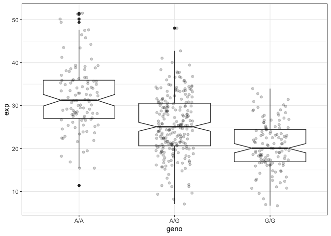

Class11
================
Wenxi Tang

``` r
#read the genotype csv file
gt <- read.csv("373531-SampleGenotypes-Homo_sapiens_Variation_Sample_rs8067378.csv")
table(gt$Genotype..forward.strand.)/nrow(gt)
```


         A|A      A|G      G|A      G|G 
    0.343750 0.328125 0.187500 0.140625 

``` r
gt$Genotype..forward.strand.
```

     [1] "A|A" "G|G" "A|A" "G|G" "G|G" "A|G" "A|G" "A|A" "A|G" "A|A" "G|A" "A|A"
    [13] "A|A" "G|G" "A|A" "A|G" "A|G" "A|G" "A|G" "G|A" "A|G" "G|G" "G|G" "G|A"
    [25] "G|G" "A|G" "A|A" "A|A" "A|G" "A|A" "A|G" "G|A" "G|G" "A|A" "A|A" "A|A"
    [37] "G|A" "A|G" "A|G" "A|G" "A|A" "G|A" "A|G" "G|A" "G|A" "A|A" "A|A" "A|G"
    [49] "A|A" "A|A" "A|G" "A|G" "A|A" "G|A" "A|A" "G|A" "A|G" "A|A" "G|A" "A|G"
    [61] "G|G" "A|A" "G|A" "A|G"

# Population scale analysis

Let’s look if there is any association of the 4 asthma-associated SNPs
on ORMDL3 expression

``` r
url <- "https://bioboot.github.io/bggn213_W19/class-material/rs8067378_ENSG00000172057.6.txt"
```

``` r
results <- read.table(url)
head(results)
```

       sample geno      exp
    1 HG00367  A/G 28.96038
    2 NA20768  A/G 20.24449
    3 HG00361  A/A 31.32628
    4 HG00135  A/A 34.11169
    5 NA18870  G/G 18.25141
    6 NA11993  A/A 32.89721

``` r
table(results$geno)
```


    A/A A/G G/G 
    108 233 121 

> Q13: Read this file into R and determine the sample size for each
> genotype and their corresponding median expression levels for each of
> these genotypes.

``` r
inds <- results$geno == "G/G"
summary(results$exp[inds])
```

       Min. 1st Qu.  Median    Mean 3rd Qu.    Max. 
      6.675  16.903  20.074  20.594  24.457  33.956 

``` r
inds <- results$geno == "A/A"
summary(results$exp[inds])
```

       Min. 1st Qu.  Median    Mean 3rd Qu.    Max. 
      11.40   27.02   31.25   31.82   35.92   51.52 

``` r
inds <- results$geno == "A/G"
summary(results$exp[inds])
```

       Min. 1st Qu.  Median    Mean 3rd Qu.    Max. 
      7.075  20.626  25.065  25.397  30.552  48.034 

> Q14. Generate a boxplot with a box per genotype, what could you infer
> from the relative expression value between A/A and G/G displayed in
> this plot? Does the SNP effect the expression of ORMDL3?

expression: A/A seems to have highest expression compared to A/G then
compared to G/G.

``` r
library(ggplot2)

ggplot(results) +
  aes(geno, exp) +
  geom_boxplot(notch = T) +
  geom_jitter(width = 0.2, alpha = 0.2) +
  theme_bw()
```


