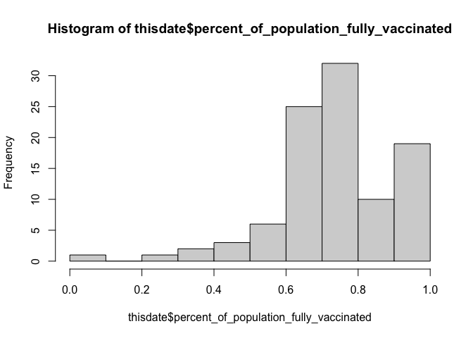
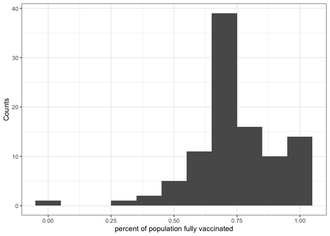
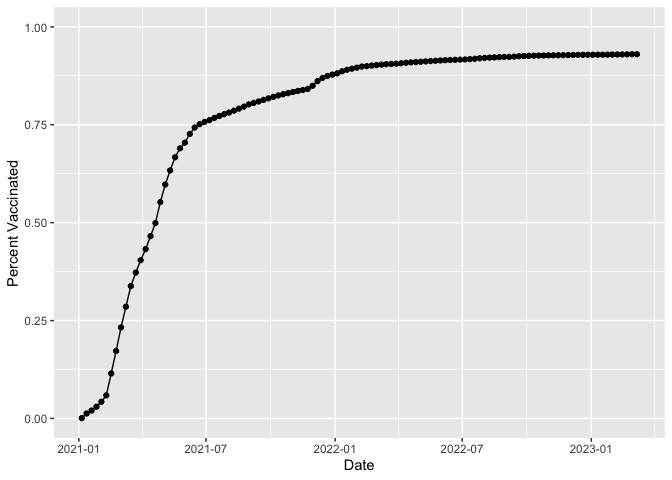
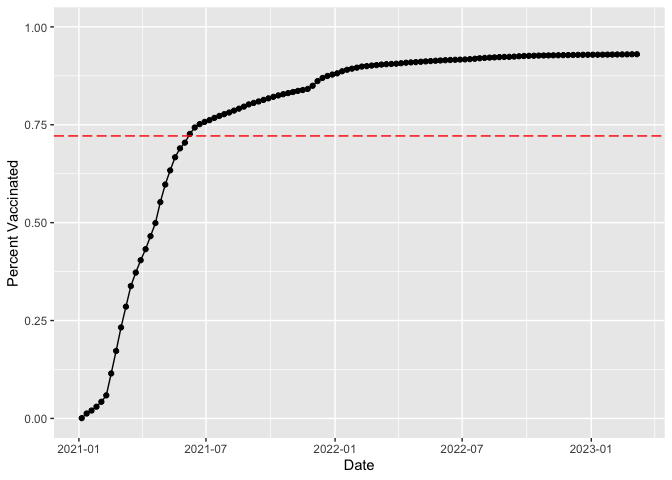
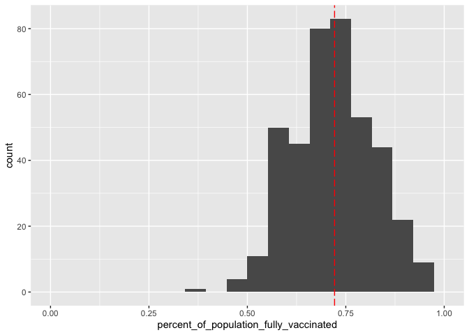
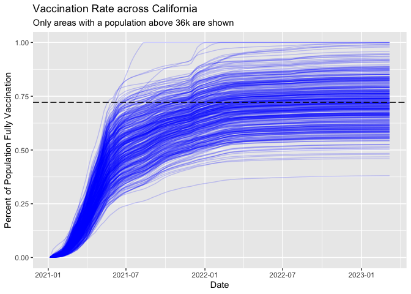

Class17: Vaccination Rate Mini Project
================
Wenxi Tang

\##Background

In today’s class, we will explore a dataset on state wide vaccination
rate from CA.gov.

The goal of this hands-on mini-project is to examine and compare the
Covid-19 vaccination rates around San Diego.

We will start by downloading the most recently dated “Statewide COVID-19
Vaccines Administered by ZIP Code” CSV file from:
https://data.ca.gov/dataset/covid-19-vaccine-progress-dashboard-data-by-zip-code

## Data input

``` r
# Import vaccination data
vax <- read.csv("covid19vaccinesbyzipcode_test.csv")
head(vax)
```

      as_of_date zip_code_tabulation_area local_health_jurisdiction          county
    1 2021-01-05                    93609                    Fresno          Fresno
    2 2021-01-05                    94086               Santa Clara     Santa Clara
    3 2021-01-05                    94304               Santa Clara     Santa Clara
    4 2021-01-05                    94110             San Francisco   San Francisco
    5 2021-01-05                    93420           San Luis Obispo San Luis Obispo
    6 2021-01-05                    93454             Santa Barbara   Santa Barbara
      vaccine_equity_metric_quartile                 vem_source
    1                              1 Healthy Places Index Score
    2                              4 Healthy Places Index Score
    3                              4 Healthy Places Index Score
    4                              4 Healthy Places Index Score
    5                              3 Healthy Places Index Score
    6                              2 Healthy Places Index Score
      age12_plus_population age5_plus_population tot_population
    1                4396.3                 4839           5177
    2               42696.0                46412          50477
    3                3263.5                 3576           3852
    4               64350.7                68320          72380
    5               26694.9                29253          30740
    6               32043.4                36446          40432
      persons_fully_vaccinated persons_partially_vaccinated
    1                       NA                           NA
    2                       11                          640
    3                       NA                           NA
    4                       18                         1262
    5                       NA                           NA
    6                       NA                           NA
      percent_of_population_fully_vaccinated
    1                                     NA
    2                               0.000218
    3                                     NA
    4                               0.000249
    5                                     NA
    6                                     NA
      percent_of_population_partially_vaccinated
    1                                         NA
    2                                   0.012679
    3                                         NA
    4                                   0.017436
    5                                         NA
    6                                         NA
      percent_of_population_with_1_plus_dose booster_recip_count
    1                                     NA                  NA
    2                               0.012897                  NA
    3                                     NA                  NA
    4                               0.017685                  NA
    5                                     NA                  NA
    6                                     NA                  NA
      bivalent_dose_recip_count eligible_recipient_count
    1                        NA                        1
    2                        NA                       11
    3                        NA                        6
    4                        NA                       18
    5                        NA                        4
    6                        NA                        5
                                                                   redacted
    1 Information redacted in accordance with CA state privacy requirements
    2 Information redacted in accordance with CA state privacy requirements
    3 Information redacted in accordance with CA state privacy requirements
    4 Information redacted in accordance with CA state privacy requirements
    5 Information redacted in accordance with CA state privacy requirements
    6 Information redacted in accordance with CA state privacy requirements

``` r
library(skimr)
```

A useful function for exploring new datasets is **skimr** package.

``` r
skimr::skim(vax)
```

|                                                  |        |
|:-------------------------------------------------|:-------|
| Name                                             | vax    |
| Number of rows                                   | 201096 |
| Number of columns                                | 18     |
| \_\_\_\_\_\_\_\_\_\_\_\_\_\_\_\_\_\_\_\_\_\_\_   |        |
| Column type frequency:                           |        |
| character                                        | 5      |
| numeric                                          | 13     |
| \_\_\_\_\_\_\_\_\_\_\_\_\_\_\_\_\_\_\_\_\_\_\_\_ |        |
| Group variables                                  | None   |

Data summary

**Variable type: character**

| skim_variable             | n_missing | complete_rate | min | max | empty | n_unique | whitespace |
|:--------------------------|----------:|--------------:|----:|----:|------:|---------:|-----------:|
| as_of_date                |         0 |             1 |  10 |  10 |     0 |      114 |          0 |
| local_health_jurisdiction |         0 |             1 |   0 |  15 |   570 |       62 |          0 |
| county                    |         0 |             1 |   0 |  15 |   570 |       59 |          0 |
| vem_source                |         0 |             1 |  15 |  26 |     0 |        3 |          0 |
| redacted                  |         0 |             1 |   2 |  69 |     0 |        2 |          0 |

**Variable type: numeric**

| skim_variable                              | n_missing | complete_rate |     mean |       sd |    p0 |      p25 |      p50 |      p75 |     p100 | hist  |
|:-------------------------------------------|----------:|--------------:|---------:|---------:|------:|---------:|---------:|---------:|---------:|:------|
| zip_code_tabulation_area                   |         0 |          1.00 | 93665.11 |  1817.38 | 90001 | 92257.75 | 93658.50 | 95380.50 |  97635.0 | ▃▅▅▇▁ |
| vaccine_equity_metric_quartile             |      9918 |          0.95 |     2.44 |     1.11 |     1 |     1.00 |     2.00 |     3.00 |      4.0 | ▇▇▁▇▇ |
| age12_plus_population                      |         0 |          1.00 | 18895.04 | 18993.87 |     0 |  1346.95 | 13685.10 | 31756.12 |  88556.7 | ▇▃▂▁▁ |
| age5_plus_population                       |         0 |          1.00 | 20875.24 | 21105.97 |     0 |  1460.50 | 15364.00 | 34877.00 | 101902.0 | ▇▃▂▁▁ |
| tot_population                             |      9804 |          0.95 | 23372.77 | 22628.50 |    12 |  2126.00 | 18714.00 | 38168.00 | 111165.0 | ▇▅▂▁▁ |
| persons_fully_vaccinated                   |     16621 |          0.92 | 13990.39 | 15073.66 |    11 |   932.00 |  8589.00 | 23346.00 |  87575.0 | ▇▃▁▁▁ |
| persons_partially_vaccinated               |     16621 |          0.92 |  1702.31 |  2033.32 |    11 |   165.00 |  1197.00 |  2536.00 |  39973.0 | ▇▁▁▁▁ |
| percent_of_population_fully_vaccinated     |     20965 |          0.90 |     0.57 |     0.25 |     0 |     0.42 |     0.61 |     0.74 |      1.0 | ▂▃▆▇▃ |
| percent_of_population_partially_vaccinated |     20965 |          0.90 |     0.08 |     0.09 |     0 |     0.05 |     0.06 |     0.08 |      1.0 | ▇▁▁▁▁ |
| percent_of_population_with_1\_plus_dose    |     22009 |          0.89 |     0.63 |     0.24 |     0 |     0.49 |     0.67 |     0.81 |      1.0 | ▂▂▅▇▆ |
| booster_recip_count                        |     72997 |          0.64 |  5882.76 |  7219.00 |    11 |   300.00 |  2773.00 |  9510.00 |  59593.0 | ▇▂▁▁▁ |
| bivalent_dose_recip_count                  |    158776 |          0.21 |  2978.23 |  3633.03 |    11 |   193.00 |  1467.50 |  4730.25 |  27694.0 | ▇▂▁▁▁ |
| eligible_recipient_count                   |         0 |          1.00 | 12830.83 | 14928.64 |     0 |   507.00 |  6369.00 | 22014.00 |  87248.0 | ▇▃▁▁▁ |

``` r
#sort(vax$as_of_date, decreasing = F)
#sort(vax$as_of_date)
```

> Q1. What column details the total number of people fully vaccinated?

The column “persons_fully_vaccinated”

> Q2. What column details the Zip code tabulation area?

The column “zip_code_tabulation_area”

> Q3. What is the earliest date in this dataset?

``` r
vax$as_of_date[1]
```

    [1] "2021-01-05"

2021-01-05

> Q4. What is the latest date in this dataset?

``` r
vax$as_of_date[nrow(vax)]
```

    [1] "2023-03-07"

2023-03-07

> Q5. How many numeric columns are in this dataset?

13

> Q6. Note that there are “missing values” in the dataset. How many NA
> values there in the persons_fully_vaccinated column?

``` r
sum(is.na(vax$persons_fully_vaccinated))
```

    [1] 16621

16621

> Q7. What percent of persons_fully_vaccinated values are missing (to 2
> significant figures)?

``` r
round(16621/nrow(vax) * 100, 2)
```

    [1] 8.27

> Q8. \[Optional\]: Why might this data be missing?

It might be some confidential federal areas, or at very early stages,
data was not collected.

\##Working with dates

We will use the *lubridate* package to help ease the pain of working
with times and dates.

``` r
library(lubridate)
```


    Attaching package: 'lubridate'

    The following objects are masked from 'package:base':

        date, intersect, setdiff, union

``` r
today()
```

    [1] "2023-03-17"

> Q9. How many days have passed since the last update of the dataset?

``` r
today() - ymd(vax$as_of_date[nrow(vax)])
```

    Time difference of 10 days

I will convert the entire “as_of_date” column to be in lubridate format.

``` r
vax$as_of_date <- ymd(vax$as_of_date)
```

``` r
today() - vax$as_of_date[(nrow(vax))]
```

    Time difference of 10 days

``` r
today() - ymd("1997-4-20")
```

    Time difference of 9462 days

> Q10. How many unique dates are in the dataset (i.e. how many different
> dates are detailed)?

``` r
length(unique(vax$as_of_date))
```

    [1] 114

``` r
library(dplyr)
```


    Attaching package: 'dplyr'

    The following objects are masked from 'package:stats':

        filter, lag

    The following objects are masked from 'package:base':

        intersect, setdiff, setequal, union

``` r
n_distinct(vax$as_of_date)
```

    [1] 114

## Working with zipcode

There are quite a few R packages that can help ease the pain of working
with ZIP codes, we will try just one of the smaller ones **zipcodeR**.

``` r
library(zipcodeR)
```

``` r
geocode_zip('92037')
```

    # A tibble: 1 × 3
      zipcode   lat   lng
      <chr>   <dbl> <dbl>
    1 92037    32.8 -117.

``` r
zip_distance('92037','92109')
```

      zipcode_a zipcode_b distance
    1     92037     92109     2.33

``` r
#Calculate the distance between the centroids of any two ZIP codes in miles, e.g.
reverse_zipcode(c('92037', "92109", "92122", "94061") )
```

    # A tibble: 4 × 24
      zipcode zipcode_…¹ major…² post_…³ common_c…⁴ county state   lat   lng timez…⁵
      <chr>   <chr>      <chr>   <chr>       <blob> <chr>  <chr> <dbl> <dbl> <chr>  
    1 92037   Standard   La Jol… La Jol… <raw 20 B> San D… CA     32.8 -117. Pacific
    2 92109   Standard   San Di… San Di… <raw 21 B> San D… CA     32.8 -117. Pacific
    3 92122   Standard   San Di… San Di… <raw 21 B> San D… CA     32.9 -117. Pacific
    4 94061   Standard   Redwoo… Redwoo… <raw 34 B> San M… CA     37.5 -122. Pacific
    # … with 14 more variables: radius_in_miles <dbl>, area_code_list <blob>,
    #   population <int>, population_density <dbl>, land_area_in_sqmi <dbl>,
    #   water_area_in_sqmi <dbl>, housing_units <int>,
    #   occupied_housing_units <int>, median_home_value <int>,
    #   median_household_income <int>, bounds_west <dbl>, bounds_east <dbl>,
    #   bounds_north <dbl>, bounds_south <dbl>, and abbreviated variable names
    #   ¹​zipcode_type, ²​major_city, ³​post_office_city, ⁴​common_city_list, …

> Q. Find the best and worst ratio of “median household income” to
> “median_home_value” in San Diego county

> Q11. How many distinct zip codes are listed for San Diego County?

``` r
sd_zip <- unique(vax$zip_code_tabulation_area[vax$county == "San Diego"])
length(sd_zip)
```

    [1] 107

``` r
sd.eco <- reverse_zipcode(sd_zip)
```

Now extract the best and worst “median household income” and
“median_home_value”

``` r
sort(sd.eco$median_household_income/sd.eco$median_home_value, decreasing = T)
```

     [1] 0.49313299 0.35517505 0.34548798 0.28576236 0.25878896 0.25671904
     [7] 0.25053447 0.22687477 0.22497633 0.22413397 0.22139649 0.21978362
    [13] 0.21812314 0.21737751 0.21539376 0.21355819 0.21243233 0.21139772
    [19] 0.20679398 0.20651554 0.20551950 0.20209350 0.20191970 0.19888657
    [25] 0.19792504 0.19422057 0.18908834 0.18908362 0.18833910 0.18786741
    [31] 0.18769501 0.18727151 0.18673482 0.18672321 0.18607322 0.18288752
    [37] 0.18134523 0.18028781 0.17915189 0.17828642 0.17770952 0.17550646
    [43] 0.17179217 0.17147450 0.16887196 0.16562207 0.16401408 0.16314344
    [49] 0.15958461 0.15884808 0.15613789 0.15532406 0.15500482 0.15364149
    [55] 0.15001161 0.14930357 0.14815293 0.14725724 0.14711029 0.14562657
    [61] 0.14452578 0.14452332 0.14416319 0.14416195 0.14400708 0.14313883
    [67] 0.14243254 0.14100882 0.14073491 0.14019337 0.13936012 0.13388495
    [73] 0.13376211 0.13327181 0.13265276 0.12806991 0.12505087 0.12381000
    [79] 0.12324040 0.12138591 0.11951699 0.11711611 0.11622243 0.11618388
    [85] 0.11487989 0.11445052 0.11431968 0.11381931 0.11355523 0.11223549
    [91] 0.10313557 0.09936690 0.09831696 0.09363608 0.09228770 0.09110291
    [97] 0.08988986

``` r
arrange(sd.eco, sd.eco$median_household_income, sd.eco$median_home_value)
```

    # A tibble: 107 × 24
       zipcode zipcode…¹ major…² post_…³ common_c…⁴ county state   lat   lng timez…⁵
       <chr>   <chr>     <chr>   <chr>       <blob> <chr>  <chr> <dbl> <dbl> <chr>  
     1 91931   PO Box    Guatay  Guatay… <raw 18 B> San D… CA     32.8 -117. Pacific
     2 92113   Standard  San Di… San Di… <raw 21 B> San D… CA     32.7 -117. Pacific
     3 92173   Standard  San Ys… San Ys… <raw 31 B> San D… CA     32.6 -117. Pacific
     4 92066   Standard  Ranchi… Ranchi… <raw 40 B> San D… CA     33.3 -116. Pacific
     5 92105   Standard  San Di… San Di… <raw 21 B> San D… CA     32.7 -117. Pacific
     6 91950   Standard  Nation… Nation… <raw 25 B> San D… CA     32.7 -117. Pacific
     7 92086   Standard  Warner… Warner… <raw 31 B> San D… CA     33.3 -117. Pacific
     8 91963   Standard  Potrero Potrer… <raw 19 B> San D… CA     32.6 -117. Pacific
     9 92004   Standard  Borreg… Borreg… <raw 32 B> San D… CA     33.1 -116. Pacific
    10 92102   Standard  San Di… San Di… <raw 21 B> San D… CA     32.7 -117. Pacific
    # … with 97 more rows, 14 more variables: radius_in_miles <dbl>,
    #   area_code_list <blob>, population <int>, population_density <dbl>,
    #   land_area_in_sqmi <dbl>, water_area_in_sqmi <dbl>, housing_units <int>,
    #   occupied_housing_units <int>, median_home_value <int>,
    #   median_household_income <int>, bounds_west <dbl>, bounds_east <dbl>,
    #   bounds_north <dbl>, bounds_south <dbl>, and abbreviated variable names
    #   ¹​zipcode_type, ²​major_city, ³​post_office_city, ⁴​common_city_list, …

``` r
# Pull data for all ZIP codes in the dataset
#zipdata <- reverse_zipcode( vax$zip_code_tabulation_area )
```

## Focus on the San Diego area

> Q12. What San Diego County Zip code area has the largest 12 +
> Population in this dataset?

``` r
sd <- filter(vax, county == "San Diego")
```

``` r
ind <- which.max(sd$age12_plus_population)
sd[ind,]
```

       as_of_date zip_code_tabulation_area local_health_jurisdiction    county
    67 2021-01-05                    92154                 San Diego San Diego
       vaccine_equity_metric_quartile                 vem_source
    67                              2 Healthy Places Index Score
       age12_plus_population age5_plus_population tot_population
    67               76365.2                82971          88979
       persons_fully_vaccinated persons_partially_vaccinated
    67                       16                         1400
       percent_of_population_fully_vaccinated
    67                                0.00018
       percent_of_population_partially_vaccinated
    67                                   0.015734
       percent_of_population_with_1_plus_dose booster_recip_count
    67                               0.015914                  NA
       bivalent_dose_recip_count eligible_recipient_count
    67                        NA                       16
                                                                    redacted
    67 Information redacted in accordance with CA state privacy requirements

> Q13. What is the overall average “Percent of Population Fully
> Vaccinated” value for all San Diego “County” as of “2023-03-07”?

``` r
vax$as_of_date[nrow(vax)]
```

    [1] "2023-03-07"

``` r
thisdate <- filter(sd, as_of_date == "2023-03-07")
```

``` r
mean(thisdate$percent_of_population_fully_vaccinated, na.rm = T)
```

    [1] 0.7402567

> Q14. Using either ggplot or base R graphics make a summary figure that
> shows the distribution of Percent of Population Fully Vaccinated
> values as of “2023-02-28”?

``` r
hist(thisdate$percent_of_population_fully_vaccinated)
```



``` r
library(ggplot2)
```

``` r
ggplot(thisdate) +
  aes(percent_of_population_fully_vaccinated) +
  geom_histogram(binwidth = 0.1) +
  theme_bw() +
  xlab("percent of population fully vaccinated") +
  ylab("Counts")
```

    Warning: Removed 8 rows containing non-finite values (`stat_bin()`).



## Focus on UCSD/La Jolla

UCSD resides in the 92037 zip code area.

``` r
ucsd <- filter(sd, zip_code_tabulation_area=="92037")
ucsd[1,]$age5_plus_population
```

    [1] 36144

> Q15. Using ggplot make a graph of the vaccination rate time course for
> the 92037 ZIP code area:

``` r
ljplot <- ggplot(ucsd) +
  aes(as_of_date,
      percent_of_population_fully_vaccinated) +
  geom_point() +
  geom_line(group=1) +
  ylim(c(0,1)) +
  labs(x = "Date", y="Percent Vaccinated")

ljplot
```



## Comparing to similar sized areas

Let’s return to the full dataset and look across every zip code area
with a population at least as large as that of 92037 on as_of_date
“2023-03-07”.

``` r
# Subset to all CA areas with a population as large as 92037
vax.36 <- filter(vax, age5_plus_population > 36144 &
                as_of_date == "2023-03-07")

head(vax.36)
```

      as_of_date zip_code_tabulation_area local_health_jurisdiction         county
    1 2023-03-07                    94116             San Francisco  San Francisco
    2 2023-03-07                    92703                    Orange         Orange
    3 2023-03-07                    94118             San Francisco  San Francisco
    4 2023-03-07                    92376            San Bernardino San Bernardino
    5 2023-03-07                    92692                    Orange         Orange
    6 2023-03-07                    95148               Santa Clara    Santa Clara
      vaccine_equity_metric_quartile                 vem_source
    1                              4 Healthy Places Index Score
    2                              1 Healthy Places Index Score
    3                              4 Healthy Places Index Score
    4                              1 Healthy Places Index Score
    5                              4 Healthy Places Index Score
    6                              4 Healthy Places Index Score
      age12_plus_population age5_plus_population tot_population
    1               42334.3                45160          47346
    2               57182.7                64387          69112
    3               37628.5                40012          42095
    4               70232.1                79686          86085
    5               41008.9                44243          46800
    6               42163.3                46202          48273
      persons_fully_vaccinated persons_partially_vaccinated
    1                    41255                         2450
    2                    57887                         7399
    3                    33284                         3040
    4                    51367                         5674
    5                    35117                         2603
    6                    42298                         2684
      percent_of_population_fully_vaccinated
    1                               0.871351
    2                               0.837582
    3                               0.790688
    4                               0.596701
    5                               0.750363
    6                               0.876225
      percent_of_population_partially_vaccinated
    1                                   0.051747
    2                                   0.107058
    3                                   0.072218
    4                                   0.065912
    5                                   0.055620
    6                                   0.055600
      percent_of_population_with_1_plus_dose booster_recip_count
    1                               0.923098               34108
    2                               0.944640               28297
    3                               0.862906               27401
    4                               0.662613               23832
    5                               0.805983               23695
    6                               0.931825               31583
      bivalent_dose_recip_count eligible_recipient_count redacted
    1                     19158                    41000       No
    2                      7627                    57775       No
    3                     15251                    33146       No
    4                      6393                    51276       No
    5                     10169                    35031       No
    6                     12604                    42120       No

> Q16. Calculate the mean “Percent of Population Fully Vaccinated” for
> ZIP code areas with a population as large as 92037 (La Jolla)
> as_of_date “2023-02-28”. Add this as a straight horizontal line to
> your plot from above with the geom_hline() function?

``` r
n_distinct(vax.36$zip_code_tabulation_area)
```

    [1] 411

``` r
mean(vax.36$percent_of_population_fully_vaccinated, na.rm = T)
```

    [1] 0.7214936

``` r
ljplot +
  geom_hline(yintercept = 0.7214936, col = "red", linetype = 5)
```



> Q17. What is the 6 number summary (Min, 1st Qu., Median, Mean, 3rd
> Qu., and Max) of the “Percent of Population Fully Vaccinated” values
> for ZIP code areas with a population as large as 92037 (La Jolla)
> as_of_date “2023-03-07”?

``` r
summary(vax.36$percent_of_population_fully_vaccinated)
```

       Min. 1st Qu.  Median    Mean 3rd Qu.    Max. 
     0.3805  0.6459  0.7183  0.7215  0.7908  1.0000 

> Q18. Using ggplot generate a histogram of this data.

``` r
ggplot(vax.36) +
  aes(percent_of_population_fully_vaccinated) +
  geom_histogram(bins = 20) +
  xlim(0,1) +
  geom_vline(xintercept = 0.7215, col = "red", linetype = 5)
```

    Warning: Removed 2 rows containing missing values (`geom_bar()`).



> Q19. Is the 92109 and 92040 ZIP code areas above or below the average
> value you calculated for all these above?

``` r
vax %>% filter(as_of_date == "2023-03-07") %>%  
  filter(zip_code_tabulation_area== "92040") %>%
  select(percent_of_population_fully_vaccinated)
```

      percent_of_population_fully_vaccinated
    1                               0.550533

``` r
filter(vax.36, zip_code_tabulation_area %in% c("92109", "92040"))
```

      as_of_date zip_code_tabulation_area local_health_jurisdiction    county
    1 2023-03-07                    92109                 San Diego San Diego
    2 2023-03-07                    92040                 San Diego San Diego
      vaccine_equity_metric_quartile                 vem_source
    1                              3 Healthy Places Index Score
    2                              3 Healthy Places Index Score
      age12_plus_population age5_plus_population tot_population
    1               43222.5                44953          47111
    2               39405.0                42833          46306
      persons_fully_vaccinated persons_partially_vaccinated
    1                    32725                         4234
    2                    25493                         2156
      percent_of_population_fully_vaccinated
    1                               0.694636
    2                               0.550533
      percent_of_population_partially_vaccinated
    1                                   0.089873
    2                                   0.046560
      percent_of_population_with_1_plus_dose booster_recip_count
    1                               0.784509               19677
    2                               0.597093               14175
      bivalent_dose_recip_count eligible_recipient_count redacted
    1                      8109                    32622       No
    2                      4649                    25433       No

They are both below 0.7215.

> Q20. Finally make a time course plot of vaccination progress for all
> areas in the full dataset with a age5_plus_population \> 36144.

``` r
last <- vax[vax$age5_plus_population > 36144,]
head(last)
```

       as_of_date zip_code_tabulation_area local_health_jurisdiction        county
    2  2021-01-05                    94086               Santa Clara   Santa Clara
    4  2021-01-05                    94110             San Francisco San Francisco
    6  2021-01-05                    93454             Santa Barbara Santa Barbara
    7  2021-01-05                    93458             Santa Barbara Santa Barbara
    9  2021-01-05                    93536               Los Angeles   Los Angeles
    12 2021-01-05                    94066                 San Mateo     San Mateo
       vaccine_equity_metric_quartile                 vem_source
    2                               4 Healthy Places Index Score
    4                               4 Healthy Places Index Score
    6                               2 Healthy Places Index Score
    7                               1 Healthy Places Index Score
    9                               2 Healthy Places Index Score
    12                              4 Healthy Places Index Score
       age12_plus_population age5_plus_population tot_population
    2                42696.0                46412          50477
    4                64350.7                68320          72380
    6                32043.4                36446          40432
    7                43262.5                51006          57256
    9                59659.1                65612          70237
    12               37730.3                40903          43101
       persons_fully_vaccinated persons_partially_vaccinated
    2                        11                          640
    4                        18                         1262
    6                        NA                           NA
    7                        NA                           NA
    9                        53                         1066
    12                       NA                           NA
       percent_of_population_fully_vaccinated
    2                                0.000218
    4                                0.000249
    6                                      NA
    7                                      NA
    9                                0.000755
    12                                     NA
       percent_of_population_partially_vaccinated
    2                                    0.012679
    4                                    0.017436
    6                                          NA
    7                                          NA
    9                                    0.015177
    12                                         NA
       percent_of_population_with_1_plus_dose booster_recip_count
    2                                0.012897                  NA
    4                                0.017685                  NA
    6                                      NA                  NA
    7                                      NA                  NA
    9                                0.015932                  NA
    12                                     NA                  NA
       bivalent_dose_recip_count eligible_recipient_count
    2                         NA                       11
    4                         NA                       18
    6                         NA                        5
    7                         NA                        2
    9                         NA                       53
    12                        NA                        3
                                                                    redacted
    2  Information redacted in accordance with CA state privacy requirements
    4  Information redacted in accordance with CA state privacy requirements
    6  Information redacted in accordance with CA state privacy requirements
    7  Information redacted in accordance with CA state privacy requirements
    9  Information redacted in accordance with CA state privacy requirements
    12 Information redacted in accordance with CA state privacy requirements

``` r
vax.36.all <- filter(vax, age5_plus_population > 36144)


ggplot(vax.36.all) +
  aes(as_of_date,
      percent_of_population_fully_vaccinated, 
      group=zip_code_tabulation_area) +
  geom_line(alpha=0.2, color="blue") +
  ylim(0,1) +
  labs(x="Date", y="Percent of Population Fully Vaccination",
       title="Vaccination Rate across California",
       subtitle="Only areas with a population above 36k are shown") +
  geom_hline(yintercept = 0.7215, linetype=5)
```

    Warning: Removed 183 rows containing missing values (`geom_line()`).



> Q21. How do you feel about traveling for Spring Break and meeting for
> in-person class afterwards?

I feel pretty safe because the vaccination rate is pretty high.
