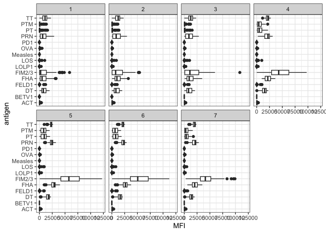
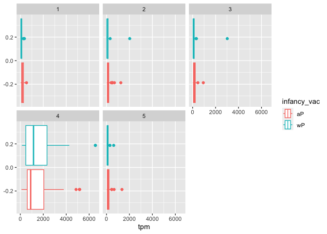

Class19
================
Wenxi Tang

# Web scrapping

Here I extract the CDC figures for Pertussis cases in USA:
https://www.cdc.gov/pertussis/surv-reporting/cases-by-year.html

> Q1. With the help of the R “addin” package datapasta assign the CDC
> pertussis case number data to a data frame called cdc and use ggplot
> to make a plot of cases numbers over time.

Let’s make a plot of number of Pertussis cases per year.

``` r
library(ggplot2)
```

> Q2. Using the ggplot geom_vline() function add lines to your previous
> plot for the 1946 introduction of the wP vaccine and the 1996 switch
> to aP vaccine (see example in the hint below). What do you notice?

The vaccine effectively brought down number of cases. The fluctuation in
number of cases may reflect vaccine hesitancy, vaccine side-effects. The
newly introduced aP vaccine seems not as effective as the wP vaccines as
after the new vaccine was introduced, the number of cases started to
fluctuate again.

``` r
base <- ggplot(cdc) + aes(Year, Cases) +
          geom_point() +
          geom_line() +
          scale_y_continuous()

base
```


The first vaccine (so called wP) was introduce in the USA in 1946. Let’s
add this as a line to our plot.

The US, and many other countries, switched from the original wP vaccine
to a new aP vaccine (acellular) in 1996. Let’s add this line to our
plot.

``` r
#add lines for introduction for vaccines. 
base + 
  geom_vline(xintercept = 1946, linetype = 5, col = "blue") +
  geom_vline(xintercept = 1996, linetype = 5, col = "red")
```


> Q3. Describe what happened after the introduction of the aP vaccine?
> Do you have a possible explanation for the observed trend?

The number of cases started to fluctuate and increase a bit before it
was introduced. Probably the aP vaccine is less effective compared to
the wP vaccine and requires a booster after a while (explains why the
first a few years were still pretty stable). Or it might be the waning
of immunity in adolescents originally primed as infants with the newer
aP vaccine as compared to the older wP vaccine.

# Explore CMI-PB data

To read these types of files into R we will use the read_json() function
from the jsonlite package. Note that if you want to do more advanced
querys of APIs directly from R you will likely want to explore the more
full featured rjson package. The big advantage of using **jsonlite** for
our current purposes is that it can simplify JSON key-value pair arrays
into R data frames without much additional effort on our part.

``` r
library(jsonlite)

subject <- read_json("http://cmi-pb.org/api/subject", simplifyVector = TRUE)

head(subject)
```

      subject_id infancy_vac biological_sex              ethnicity  race
    1          1          wP         Female Not Hispanic or Latino White
    2          2          wP         Female Not Hispanic or Latino White
    3          3          wP         Female                Unknown White
    4          4          wP           Male Not Hispanic or Latino Asian
    5          5          wP           Male Not Hispanic or Latino Asian
    6          6          wP         Female Not Hispanic or Latino White
      year_of_birth date_of_boost      dataset
    1    1986-01-01    2016-09-12 2020_dataset
    2    1968-01-01    2019-01-28 2020_dataset
    3    1983-01-01    2016-10-10 2020_dataset
    4    1988-01-01    2016-08-29 2020_dataset
    5    1991-01-01    2016-08-29 2020_dataset
    6    1988-01-01    2016-10-10 2020_dataset

``` r
dim(subject)
```

    [1] 96  8

> Q4. How many aP and wP infancy vaccinated subjects are in the dataset?

``` r
table(subject$infancy_vac)
```


    aP wP 
    47 49 

> Q5. How many Male and Female subjects/patients are in the dataset?

``` r
table(subject$biological_sex)
```


    Female   Male 
        66     30 

> Q6. What is the breakdown of race and biological sex (e.g. number of
> Asian females, White males etc…)?

``` r
table(subject$race, subject$biological_sex)
```

                                               
                                                Female Male
      American Indian/Alaska Native                  0    1
      Asian                                         18    9
      Black or African American                      2    0
      More Than One Race                             8    2
      Native Hawaiian or Other Pacific Islander      1    1
      Unknown or Not Reported                       10    4
      White                                         27   13

Let’s look at the specimen table next:

``` r
specimen <- read_json("http://cmi-pb.org/api/specimen", simplifyVector = TRUE)
head(specimen)
```

      specimen_id subject_id actual_day_relative_to_boost
    1           1          1                           -3
    2           2          1                          736
    3           3          1                            1
    4           4          1                            3
    5           5          1                            7
    6           6          1                           11
      planned_day_relative_to_boost specimen_type visit
    1                             0         Blood     1
    2                           736         Blood    10
    3                             1         Blood     2
    4                             3         Blood     3
    5                             7         Blood     4
    6                            14         Blood     5

``` r
dim(specimen)
```

    [1] 729   6

To know whether a given specimen_id comes from an aP or wP individual we
need to link (a.k.a. “join” or merge) our specimen and subject data
frames. The excellent dplyr package (that we have used previously) has a
family of join() functions that can help us with this common task:

> Q9. Complete the code to join specimen and subject tables to make a
> new merged data frame containing all specimen records along with their
> associated subject details:

``` r
library(dplyr)
```


    Attaching package: 'dplyr'

    The following objects are masked from 'package:stats':

        filter, lag

    The following objects are masked from 'package:base':

        intersect, setdiff, setequal, union

``` r
meta <- inner_join(specimen, subject)
```

    Joining with `by = join_by(subject_id)`

``` r
dim(meta)
```

    [1] 729  13

``` r
head(meta)
```

      specimen_id subject_id actual_day_relative_to_boost
    1           1          1                           -3
    2           2          1                          736
    3           3          1                            1
    4           4          1                            3
    5           5          1                            7
    6           6          1                           11
      planned_day_relative_to_boost specimen_type visit infancy_vac biological_sex
    1                             0         Blood     1          wP         Female
    2                           736         Blood    10          wP         Female
    3                             1         Blood     2          wP         Female
    4                             3         Blood     3          wP         Female
    5                             7         Blood     4          wP         Female
    6                            14         Blood     5          wP         Female
                   ethnicity  race year_of_birth date_of_boost      dataset
    1 Not Hispanic or Latino White    1986-01-01    2016-09-12 2020_dataset
    2 Not Hispanic or Latino White    1986-01-01    2016-09-12 2020_dataset
    3 Not Hispanic or Latino White    1986-01-01    2016-09-12 2020_dataset
    4 Not Hispanic or Latino White    1986-01-01    2016-09-12 2020_dataset
    5 Not Hispanic or Latino White    1986-01-01    2016-09-12 2020_dataset
    6 Not Hispanic or Latino White    1986-01-01    2016-09-12 2020_dataset

> Q10. Now using the same procedure join meta with titer data so we can
> further analyze this data in terms of time of visit aP/wP, male/female
> etc.

``` r
#read the titer dataset
titer <- read_json("http://cmi-pb.org/api/ab_titer", simplifyVector = TRUE) 

#joining the titer dataset with the meta dataset
abdata <- inner_join(titer, meta)
```

    Joining with `by = join_by(specimen_id)`

``` r
dim(abdata)
```

    [1] 32675    20

``` r
head(abdata)
```

      specimen_id isotype is_antigen_specific antigen        MFI MFI_normalised
    1           1     IgE               FALSE   Total 1110.21154       2.493425
    2           1     IgE               FALSE   Total 2708.91616       2.493425
    3           1     IgG                TRUE      PT   68.56614       3.736992
    4           1     IgG                TRUE     PRN  332.12718       2.602350
    5           1     IgG                TRUE     FHA 1887.12263      34.050956
    6           1     IgE                TRUE     ACT    0.10000       1.000000
       unit lower_limit_of_detection subject_id actual_day_relative_to_boost
    1 UG/ML                 2.096133          1                           -3
    2 IU/ML                29.170000          1                           -3
    3 IU/ML                 0.530000          1                           -3
    4 IU/ML                 6.205949          1                           -3
    5 IU/ML                 4.679535          1                           -3
    6 IU/ML                 2.816431          1                           -3
      planned_day_relative_to_boost specimen_type visit infancy_vac biological_sex
    1                             0         Blood     1          wP         Female
    2                             0         Blood     1          wP         Female
    3                             0         Blood     1          wP         Female
    4                             0         Blood     1          wP         Female
    5                             0         Blood     1          wP         Female
    6                             0         Blood     1          wP         Female
                   ethnicity  race year_of_birth date_of_boost      dataset
    1 Not Hispanic or Latino White    1986-01-01    2016-09-12 2020_dataset
    2 Not Hispanic or Latino White    1986-01-01    2016-09-12 2020_dataset
    3 Not Hispanic or Latino White    1986-01-01    2016-09-12 2020_dataset
    4 Not Hispanic or Latino White    1986-01-01    2016-09-12 2020_dataset
    5 Not Hispanic or Latino White    1986-01-01    2016-09-12 2020_dataset
    6 Not Hispanic or Latino White    1986-01-01    2016-09-12 2020_dataset

> Q. What do you notice about the “visit” number 8?

It’s only 80 compared to others which are all a few thousands.

``` r
table(abdata$visit)
```


       1    2    3    4    5    6    7    8 
    5795 4640 4640 4640 4640 4320 3920   80 

> Q. How many isotypes do we have in this dataset?

> Q11. How many specimens (i.e. entries in abdata) do we have for each
> isotype?

``` r
table(titer$isotype)
```


     IgE  IgG IgG1 IgG2 IgG3 IgG4 
    6698 1413 6141 6141 6141 6141 

> Q12. What do you notice about the number of visit 8 specimens compared
> to other visits?

# Examine IgG1 Ab titer levels

``` r
#filter only the igg1 data
ig1 <- abdata %>% filter(isotype == "IgG1", visit!=8)
head(ig1)
```

      specimen_id isotype is_antigen_specific antigen        MFI MFI_normalised
    1           1    IgG1                TRUE     ACT 274.355068      0.6928058
    2           1    IgG1                TRUE     LOS  10.974026      2.1645083
    3           1    IgG1                TRUE   FELD1   1.448796      0.8080941
    4           1    IgG1                TRUE   BETV1   0.100000      1.0000000
    5           1    IgG1                TRUE   LOLP1   0.100000      1.0000000
    6           1    IgG1                TRUE Measles  36.277417      1.6638332
       unit lower_limit_of_detection subject_id actual_day_relative_to_boost
    1 IU/ML                 3.848750          1                           -3
    2 IU/ML                 4.357917          1                           -3
    3 IU/ML                 2.699944          1                           -3
    4 IU/ML                 1.734784          1                           -3
    5 IU/ML                 2.550606          1                           -3
    6 IU/ML                 4.438966          1                           -3
      planned_day_relative_to_boost specimen_type visit infancy_vac biological_sex
    1                             0         Blood     1          wP         Female
    2                             0         Blood     1          wP         Female
    3                             0         Blood     1          wP         Female
    4                             0         Blood     1          wP         Female
    5                             0         Blood     1          wP         Female
    6                             0         Blood     1          wP         Female
                   ethnicity  race year_of_birth date_of_boost      dataset
    1 Not Hispanic or Latino White    1986-01-01    2016-09-12 2020_dataset
    2 Not Hispanic or Latino White    1986-01-01    2016-09-12 2020_dataset
    3 Not Hispanic or Latino White    1986-01-01    2016-09-12 2020_dataset
    4 Not Hispanic or Latino White    1986-01-01    2016-09-12 2020_dataset
    5 Not Hispanic or Latino White    1986-01-01    2016-09-12 2020_dataset
    6 Not Hispanic or Latino White    1986-01-01    2016-09-12 2020_dataset

``` r
dim(ig1)
```

    [1] 6126   20

> Q. How many antigens are there?

``` r
table(ig1$antigen)
```


        ACT   BETV1      DT   FELD1     FHA  FIM2/3   LOLP1     LOS Measles     OVA 
        393     393     426     393     426     426     393     393     393     426 
        PD1     PRN      PT     PTM      TT 
        393     426     426     393     426 

Analysis of the whole dataset: antigen levels - i.e. a plot of antigen
vs MFI.

``` r
ggplot(ig1) +
  aes(MFI, antigen) +
  geom_boxplot() + 
  facet_wrap(vars(visit), nrow=2) +
  theme_bw()
```



> Q14. What antigens show differences in the level of IgG1 antibody
> titers recognizing them over time? Why these and not others?

The FIM2/3, TT, PRN increases along with visits. Probably because these
antigens are extracellular and easily recognized by antibodies.

``` r
ggplot(ig1) +
  aes(MFI, antigen, col = infancy_vac) +
  geom_boxplot() + 
  facet_wrap(vars(visit), nrow=2) +
  theme_bw() +
  theme(axis.text.x = element_text(angle = 45, hjust=1))
```


> Q15. Filter to pull out only two specific antigens for analysis and
> create a boxplot for each. You can chose any you like. Below I picked
> a “control” antigen (“Measles”, that is not in our vaccines) and a
> clear antigen of interest (“FIM2/3”, extra-cellular fimbriae proteins
> from B. pertussis that participate in substrate attachment).

``` r
#MEASLE ANTIGEN LEVELS
filter(ig1, antigen=="Measles") %>%
  ggplot() +
  aes(MFI, col=infancy_vac) +
  geom_boxplot(show.legend = FALSE) +
  facet_wrap(vars(visit)) +
  theme_bw()
```


``` r
#FIM2/3 ANTIGEN LEVEL
filter(ig1, antigen=="FIM2/3") %>%
  ggplot() +
  aes(MFI, col=infancy_vac) +
  geom_boxplot(show.legend = FALSE) +
  facet_wrap(vars(visit)) +
  theme_bw()
```


``` r
#PT ANTIGEN LEVEL
filter(ig1, antigen=="PT") %>%
  ggplot() +
  aes(MFI, col=infancy_vac) +
  geom_boxplot(show.legend = FALSE) +
  facet_wrap(vars(visit)) +
  theme_bw()
```


> Q16. What do you notice about these two antigens time courses and the
> FIM2/3 data in particular?

The level of FIM2/3 and PT shows an increasing trend and shows a peak
around 4th\~6th visits. Definitely an obvious increase compared to the
measles control.

> Q17. Do you see any clear difference in aP vs. wP responses?

They show similar increasing trends along with visits. No clear
differences.

# Obtaining CMI-PB RNASeq data

``` r
#read the input data
url <- "https://www.cmi-pb.org/api/v2/rnaseq?versioned_ensembl_gene_id=eq.ENSG00000211896.7"

rna <- read_json(url, simplifyVector = TRUE) 
head(rna)
```

      versioned_ensembl_gene_id specimen_id raw_count      tpm
    1         ENSG00000211896.7         344     18613  929.640
    2         ENSG00000211896.7         243      2011  112.584
    3         ENSG00000211896.7         261      2161  124.759
    4         ENSG00000211896.7         282      2428  138.292
    5         ENSG00000211896.7         345     51963 2946.136
    6         ENSG00000211896.7         244     49652 2356.749

To facilitate further analysis we need to “join” the rna expression data
with our metadata meta, which is itself a join of sample and specimen
data. This will allow us to look at this genes TPM expression values
over aP/wP status and at different visits (i.e. times):

``` r
ssrna <- inner_join(rna, meta)
```

    Joining with `by = join_by(specimen_id)`

``` r
dim(ssrna)
```

    [1] 360  16

> Q18. Make a plot of the time course of gene expression for IGHG1 gene
> (i.e. a plot of visit vs. tpm).

``` r
ggplot(ssrna) +
  aes(visit, tpm, group=subject_id) +
  geom_point() +
  geom_line(alpha=0.2)
```


> Q19.: What do you notice about the expression of this gene (i.e. when
> is it at it’s maximum level)?

It has a maximum level at the 4th visit and starts to drop on the 5th
visit.

> Q20. Does this pattern in time match the trend of antibody titer data?
> If not, why not?

The expression peak is earlier than the antibody peak, which is around
the 5th visit. And the antibody titer stays longer. This makes sense
because we need the expression, protein production is followed and it
can stay for a while.

We can dig deeper and color and/or facet by infancy_vac status:

``` r
ggplot(ssrna) +
  aes(tpm, col=infancy_vac) +
  geom_boxplot() +
  facet_wrap(vars(visit))
```



There is however no obvious wP vs. aP differences here even if we focus
in on a particular visit:

``` r
ssrna %>%  
  filter(visit==4) %>% 
  ggplot() +
    aes(tpm, col=infancy_vac) + geom_density() + 
    geom_rug() 
```


> Q. Is RNA-Seq expression levels predictive of Ab titers?

Yes, it’s quite predictive.

> Q. What differentiates aP vs. wP primed individuals?

There are some differences between aP and wP individuals but we still
not sure how to differentiate them.
