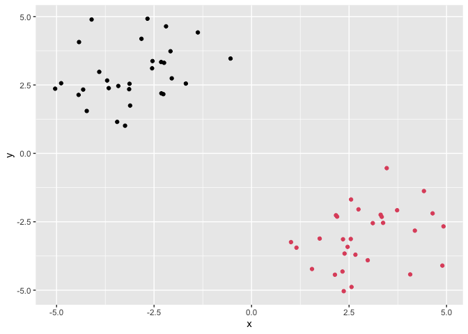
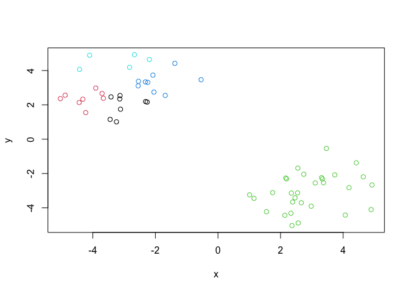
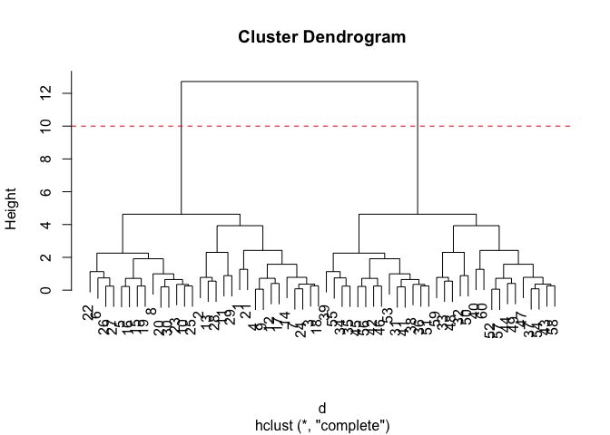

Class 7: Machine Learning 1
================
Wenxi Tang

In this class we will explore and get practice with clustering and
Principal Component Analysis (PCA)

# Clustering with K-means

First we will make up some data to cluster where we know what the result
should be.

``` r
hist(rnorm(30000, mean = -3))
```


I want a little vector with two groupings in it:

``` r
tmp <- c(rnorm(30, -3), rnorm(30, 3))
x <- data.frame(x = tmp, y = rev(tmp))
head(x)
```

              x        y
    1 -1.377236 4.419960
    2 -2.823359 4.187612
    3 -2.540061 3.373422
    4 -2.262265 2.164579
    5 -4.318062 2.331858
    6 -3.114227 1.746939

Let’s have a look at the plot

``` r
plot(x)
```


``` r
km <- kmeans(x, center = 2)
km
```

    K-means clustering with 2 clusters of sizes 30, 30

    Cluster means:
              x         y
    1 -3.060805  2.911656
    2  2.911656 -3.060805

    Clustering vector:
     [1] 1 1 1 1 1 1 1 1 1 1 1 1 1 1 1 1 1 1 1 1 1 1 1 1 1 1 1 1 1 1 2 2 2 2 2 2 2 2
    [39] 2 2 2 2 2 2 2 2 2 2 2 2 2 2 2 2 2 2 2 2 2 2

    Within cluster sum of squares by cluster:
    [1] 65.08307 65.08307
     (between_SS / total_SS =  89.2 %)

    Available components:

    [1] "cluster"      "centers"      "totss"        "withinss"     "tot.withinss"
    [6] "betweenss"    "size"         "iter"         "ifault"      

It is important to not just run the analysis but to be able to get your
important results back in a way we can do things with it.

> Q. How do I find the cluster sizes?

``` r
km$size
```

    [1] 30 30

> Q. How about the cluster centers?

``` r
km$centers
```

              x         y
    1 -3.060805  2.911656
    2  2.911656 -3.060805

> Q. How about the main result - the cluster assignment vector?

``` r
km$cluster
```

     [1] 1 1 1 1 1 1 1 1 1 1 1 1 1 1 1 1 1 1 1 1 1 1 1 1 1 1 1 1 1 1 2 2 2 2 2 2 2 2
    [39] 2 2 2 2 2 2 2 2 2 2 2 2 2 2 2 2 2 2 2 2 2 2

> Q. Can we make a summary figure showing result? - The points colored
> by cluster assignment and maybe add the cluster centers to different
> colors.

``` r
#basic R plot uses number for default colors. 
plot(x, col = km$cluster)
```


Use ggplot to do it:

``` r
library(ggplot2)
```

I need 3 things: data, aes, geoms

``` r
ggplot(x) +
  aes(x, y) +
  geom_point(col = km$cluster)
```



``` r
#Make up a color vector
mycols <- rep("gray", 60)
```

``` r
plot(x, col=mycols)
```


Let’s highlight point 10, 12, 20.

``` r
mycols[c(10, 12, 20)] <- "red"
plot(x, col=mycols, pch=18)
```


Play with different number of centers.

``` r
km <- kmeans(x, centers = 5)
plot(x, col=km$cluster)
```



``` r
#We can use this value to generate a SCREE plot, which indicates the elbow point (when you increase number of centers, no more big change)
km$tot.withinss
```

    [1] 82.13887

What we want to do is to try out different numbers of K from 1 to 7. We
can write a `for` loop to do this for us and store the `$tot.withinss`
each time.

``` r
totss <- NULL
k <- 1:7

for (i in k) {
  #cat(i, "\n")
  totss <- c(totss, kmeans(x, centers = i)$tot.withinss)
}
```

``` r
#make the SCREE plot. 
plot(totss, typ = "o")
```


# Hierarchical Clustering

We can not just give the `hclust()` function of input data `x` like we
did for `kmeans()`.

We need to first calculate a “distance matrix”. The `dist()` function by
default will calculate euclidean distance.

``` r
d <- dist(x)
hc <- hclust(d)
hc
```


    Call:
    hclust(d = d)

    Cluster method   : complete 
    Distance         : euclidean 
    Number of objects: 60 

The print out is not very helpful but the plot method is useful.

``` r
plot(hc)
abline(h=10, col="red", lty= 2)
```



To get my all important cluster membership vector out of a hclust object
I can use the `cutree()`

``` r
cutree(hc, h=10)
```

     [1] 1 1 1 1 1 1 1 1 1 1 1 1 1 1 1 1 1 1 1 1 1 1 1 1 1 1 1 1 1 1 2 2 2 2 2 2 2 2
    [39] 2 2 2 2 2 2 2 2 2 2 2 2 2 2 2 2 2 2 2 2 2 2

You can also set a `k=` argument to `cutree()`

``` r
#k = argument means how many clusters you want leave with
grps <- cutree(hc, k=2)
grps
```

     [1] 1 1 1 1 1 1 1 1 1 1 1 1 1 1 1 1 1 1 1 1 1 1 1 1 1 1 1 1 1 1 2 2 2 2 2 2 2 2
    [39] 2 2 2 2 2 2 2 2 2 2 2 2 2 2 2 2 2 2 2 2 2 2

Make a figure of our hclust results

``` r
plot(x, col = grps)
```


\#Principal Component Analysis

The main base R functions to do PCA is called `prcomp()`.

The motivation is to reduce the features dimensionality while only
losing a small amount of information.

## PCA of UK food data

First I need to import the data.

``` r
url <- "https://tinyurl.com/UK-foods"
x <- read.csv(url)
x
```

                         X England Wales Scotland N.Ireland
    1               Cheese     105   103      103        66
    2        Carcass_meat      245   227      242       267
    3          Other_meat      685   803      750       586
    4                 Fish     147   160      122        93
    5       Fats_and_oils      193   235      184       209
    6               Sugars     156   175      147       139
    7      Fresh_potatoes      720   874      566      1033
    8           Fresh_Veg      253   265      171       143
    9           Other_Veg      488   570      418       355
    10 Processed_potatoes      198   203      220       187
    11      Processed_Veg      360   365      337       334
    12        Fresh_fruit     1102  1137      957       674
    13            Cereals     1472  1582     1462      1494
    14           Beverages      57    73       53        47
    15        Soft_drinks     1374  1256     1572      1506
    16   Alcoholic_drinks      375   475      458       135
    17      Confectionery       54    64       62        41

> Q1. How many rows and columns are in your new data frame named x?

``` r
dim(x)
```

    [1] 17  5

I want the food and drink as rownames not the first column.

``` r
rownames(x) <- x[,1]
x <- x[,-1]
head(x)
```

                   England Wales Scotland N.Ireland
    Cheese             105   103      103        66
    Carcass_meat       245   227      242       267
    Other_meat         685   803      750       586
    Fish               147   160      122        93
    Fats_and_oils      193   235      184       209
    Sugars             156   175      147       139

``` r
dim(x)
```

    [1] 17  4

Better to just read it again with the `row.names = 1` argument.

``` r
x <- read.csv(url, row.names = 1)
head(x)
```

                   England Wales Scotland N.Ireland
    Cheese             105   103      103        66
    Carcass_meat       245   227      242       267
    Other_meat         685   803      750       586
    Fish               147   160      122        93
    Fats_and_oils      193   235      184       209
    Sugars             156   175      147       139

``` r
ggplot(x) +
  aes(England, Scotland) +
  geom_point()
```


> Q2. Which approach to solving the ‘row-names problem’ mentioned above
> do you prefer and why? Is one approach more robust than another under
> certain circumstances?

The `row.names = 1` method is better and more robust because we can use
any column as rownames and it won’t delete columns by accident.

``` r
barplot(as.matrix(x), beside=T, col=rainbow(nrow(x)))
```


> Q3: Changing what optional argument in the above barplot() function
> results in the following plot?

``` r
#Change `beside = FALSE` or just delete this argument because the default is beside = FALSE
barplot(as.matrix(x), beside=F, col=rainbow(nrow(x)))
```


> Q5: Generating all pairwise plots may help somewhat. Can you make
> sense of the following code and resulting figure? What does it mean if
> a given point lies on the diagonal for a given plot?

The following code compares the 4 countries with their consumption of
food and drink in pairs. If a point lies on the disgonal for a given
plot, it suggests that the food or drink representing this point is the
same for the two countries being compared.

``` r
pairs(x, col=rainbow(10), pch=16)
```


> Q6. What is the main differences between N. Ireland and the other
> countries of the UK in terms of this data-set?

If looking at the paired plot, the food or drink represented by the dark
blue point which deviates the most in the plots is the main difference
between N. Ireland and other countries. N. Ireland consumes more dark
blue than other countries. The second point deviates a lot from the
diagonal is the orange point, which N. Ireland consumes less compared to
other countries.

``` r
# Use the prcomp() PCA function 
pca <- prcomp( t(x) )
summary(pca)
```

    Importance of components:
                                PC1      PC2      PC3       PC4
    Standard deviation     324.1502 212.7478 73.87622 4.189e-14
    Proportion of Variance   0.6744   0.2905  0.03503 0.000e+00
    Cumulative Proportion    0.6744   0.9650  1.00000 1.000e+00

``` r
attributes(pca)
```

    $names
    [1] "sdev"     "rotation" "center"   "scale"    "x"       

    $class
    [1] "prcomp"

``` r
pca$x
```

                     PC1         PC2         PC3           PC4
    England   -144.99315    2.532999 -105.768945  2.842865e-14
    Wales     -240.52915  224.646925   56.475555  7.804382e-13
    Scotland   -91.86934 -286.081786   44.415495 -9.614462e-13
    N.Ireland  477.39164   58.901862    4.877895  1.448078e-13

> Q7. Complete the code below to generate a plot of PC1 vs PC2. The
> second line adds text labels over the data points.

``` r
# Plot PC1 vs PC2
plot(pca$x[,1], pca$x[,2],, xlab="PC1", ylab="PC2", xlim=c(-270,500))
text(pca$x[,1], pca$x[,2], colnames(x))
```


> Q8. Customize your plot so that the colors of the country names match
> the colors in our UK and Ireland map and table at start of this
> document.

``` r
# Plot PC1 vs PC2
plot(pca$x[,1], pca$x[,2],, xlab="PC1", ylab="PC2", xlim=c(-270,500), col=c("orange", "pink", "blue", "darkgreen"), pch=16)
text(pca$x[,1], pca$x[,2], colnames(x), col=c("orange", "pink", "blue", "darkgreen"))
abline(h=0, col="gray", lty = 2)
abline(v=0, col="gray", lty = 2)
```


Let’s look at how the original variable attribute to our new axis of max
variance aka PCs.

``` r
loadings <- as.data.frame((pca$rotation))

ggplot(loadings) +
  aes(PC1, rownames(loadings)) +
  geom_col()
```


> Q9: Generate a similar ‘loadings plot’ for PC2. What two food groups
> feature prominantely and what does PC2 maninly tell us about?

In PC2, the most prominent difference are soft drinks (high negative
score) and fresh potatoes (high positive score), it suggests that these
two food and drinks contributes most to the variance represented by PC2.

``` r
ggplot(loadings) +
  aes(PC2, rownames(loadings)) +
  geom_col()
```


